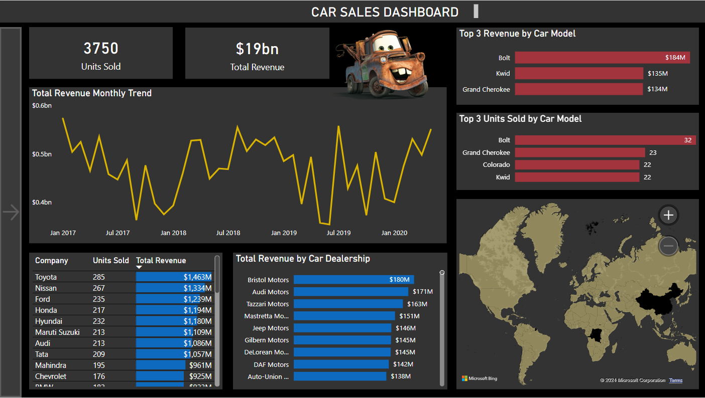
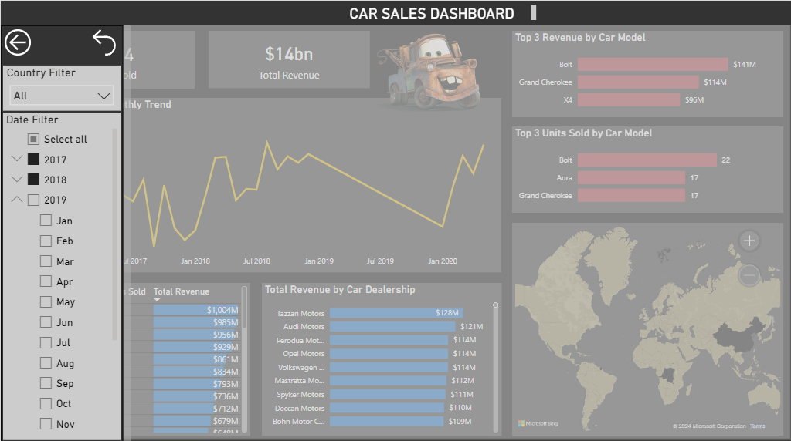

# Car Sales Dashboard

## Loading of Data
The data set used in this project was taken from the following [link](https://tableauserverguru.files.wordpress.com/2020/06/star-schema-2.xlsx). It is an Excel file containing six tables. Each table was loaded into a Postgre database through the script [**upload_to_postgre.py**](./upload_to_postgre.py). Before loading the data, tables were created using [**table_schema.py**](./table_schema.py) where the tables follow a snowflake schema. 

## Dashboard Creation
The database was then connected to PowerBI and a car sales dashboard was made. Every visuals filter each other and the user can filter by date (year and month) through a side panel.

&nbsp;

